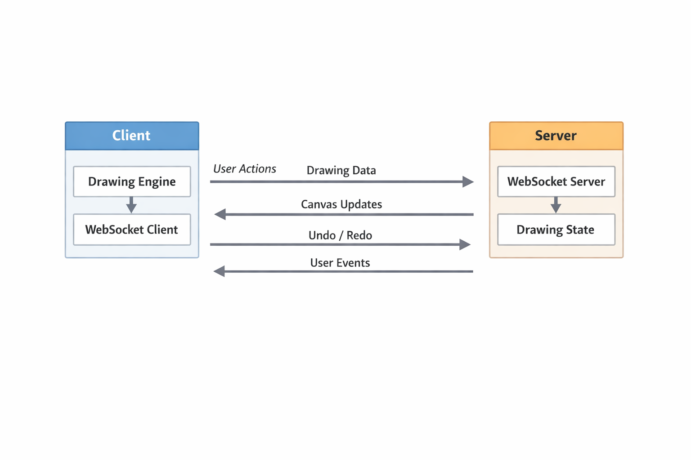

The app is built in a client–server model.
The client only sends what the user is trying to do (mouse movement, drawing points, undo, redo).
The server keeps the main drawing state and decides what the final canvas looks like.
This way, all users always see the same result, even if they draw at the same time.
How Data Flows
When a user draws something, this is what happens:
User moves mouse / draws
→ Browser captures the input
→ Data is sent to the server using WebSocket
→ Server updates the shared canvas state
→ Server sends updates to all users
→ Everyone’s canvas updates
This happens very fast, so the drawing feels real-time.
WebSocket Communication
The app uses WebSockets to send small messages back and forth.
Messages Sent From Client to Server
cursor
Sent when the mouse moves, so others can see the cursor.
draw
Sent while drawing to create smooth strokes.
stroke:add
Sent when a full stroke is finished.
undo / redo
Sent when a user presses undo or redo.
Messages Sent From Server to Client
init
Sends the existing drawing when a new user joins.
user:init
Gives each user a unique ID and color.
users:update
Updates the list of connected users.
cursor
Sends live cursor positions of other users.
canvas:reset
Sent after undo/redo so everyone redraws the same canvas.
Undo / Redo Logic
Undo and redo are handled only on the server.
The server stores:
A list of completed strokes
A separate list for undone strokes
When undo is pressed:
Last stroke is removed
It is saved for redo
Server sends the updated canvas to everyone
When redo is pressed:
The stroke is added back
Canvas is sent again to all users
This keeps undo/redo global and consistent for all clients.